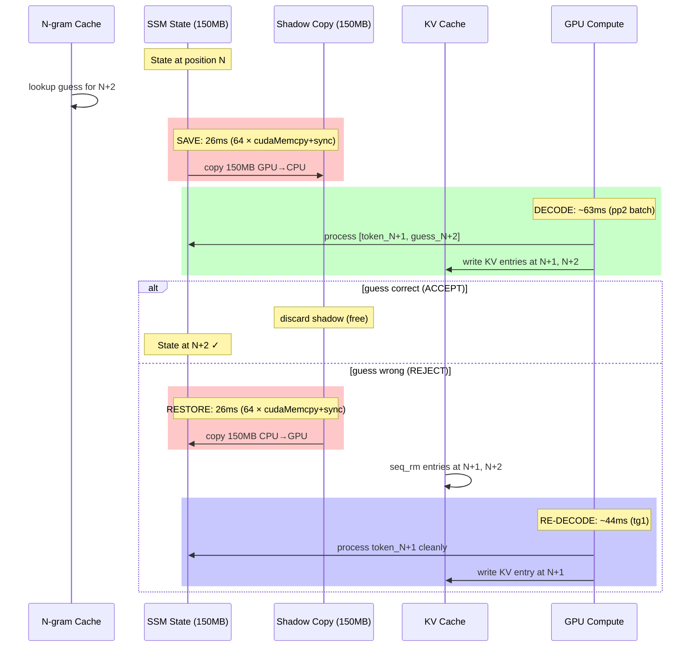
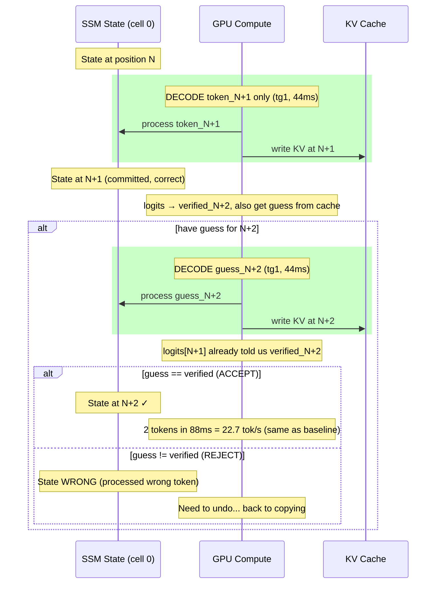
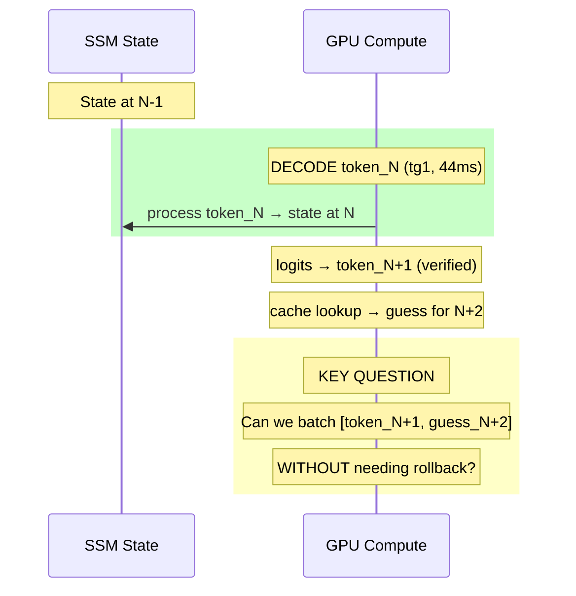
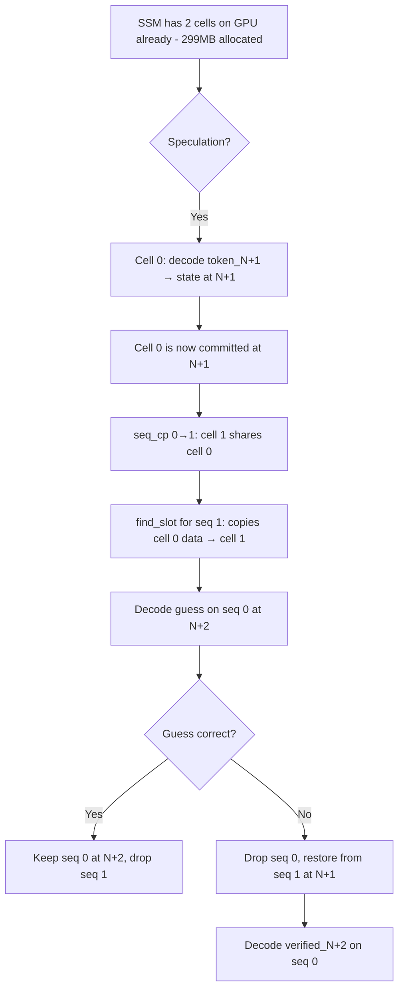

# Speculative Decode Flow Analysis

## Current Flow (shadow copy)



## Cost Analysis

```
ACCEPT path: 26ms (save) + 63ms (pp2) = 89ms for 2 tokens = 22.5 tok/s
REJECT path: 26ms (save) + 63ms (pp2) + 26ms (restore) + 44ms (redecode) = 159ms for 1 token = 6.3 tok/s
BASELINE:    44ms (tg1) for 1 token = 22.7 tok/s

At 90% accept: 0.9 × 89 + 0.1 × 159 = 96ms for 1.9 tokens = 19.8 tok/s — SLOWER than baseline!
```

**The shadow save/restore (52ms round trip) eats ALL the speculation gain.**

## The Git Insight

Git doesn't copy the whole repo for each commit. It stores:
1. The **current state** (working tree)
2. A **ref** to the parent commit
3. Only the **diff** (changed files)

For SSM state:
- The "working tree" = current R/S tensors (cell 0)
- The "parent commit" = state before speculation
- The "diff" = what the speculation changed

**We don't need to copy 150MB. We need to UNDO the diff.**

## The Undo Approach



**Wait — this is just 2 sequential decodes. No speedup.**

## The REAL Insight: Batch Without Rollback

The speedup comes from pp2 (2 tokens in 63ms vs 2×44ms=88ms).
But pp2 requires knowing BOTH tokens upfront.

We know token_N+1 (from logits after decoding token_N).
We need to GUESS token_N+2.



## The Double-Buffer Approach (no copy needed)



**The key: commit token_N+1 FIRST (single decode), THEN speculate on N+2.**

After committing N+1, the state is correct. The speculation on N+2 can be rolled back to N+1 (which is in cell 1).

But this is 2 separate decodes (44ms + 44ms = 88ms) not a pp2 batch (63ms). The pp2 gain is lost.

## The REAL Solution: Accept That pp2 Requires Upfront Knowledge

```
pp2 batch [A, B] at positions [N, N+1]:
- Attention: A sees pos 0..N-1, B sees pos 0..N
- SSM: processes A then B sequentially
- Cost: 63ms (one weight read)

To use pp2, we need BOTH A and B before the batch.
A = token_N+1 (known from previous logits)
B = guess_N+2 (from cache)

If B is wrong, SSM processed wrong token → need rollback.
Rollback cost = shadow save + restore = 52ms.
Net: 63ms + 52ms = 115ms for 1 token on reject.

The ONLY way to avoid rollback: never be wrong.
Or: make rollback cost → 0.
```

## Making Rollback Cost → 0

The RS buffer has 2 cells (299MB). Cell 0 = active, Cell 1 = empty.

**Before pp2 batch:** copy cell 0 → cell 1 ON GPU.
- 150MB at 448 GB/s = 0.33ms
- But needs CUDA API (not available in .cpp files)

**After pp2 batch (reject):** copy cell 1 → cell 0 ON GPU.
- 0.33ms

**Total rollback cost: 0.66ms** (vs 52ms currently)

```
ACCEPT: 0.33ms (save) + 63ms (pp2) = 63.3ms for 2 tokens = 31.6 tok/s (+39%)
REJECT: 0.33ms (save) + 63ms (pp2) + 0.33ms (restore) + 44ms (redecode) = 107.7ms for 1 token
At 90% accept: 0.9 × 63.3 + 0.1 × 107.7 = 67.7ms for 1.9 tokens = 28.1 tok/s (+24%)
```

## Implementation: Move Shadow to .cu File

```
ggml/src/ggml-cuda/ssm-shadow.cu:
  void ssm_shadow_save(tensors, n_tensors)  — cudaMemcpyAsync D2D × N, 1 sync
  void ssm_shadow_restore(tensors, n_tensors) — cudaMemcpyAsync D2D × N, 1 sync
```
